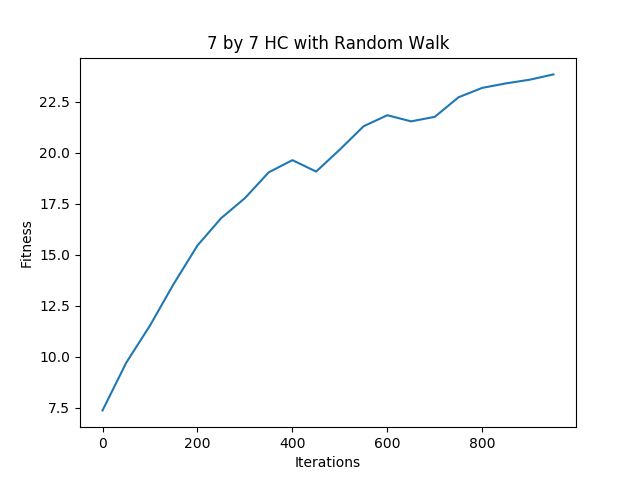

# Local Search

CS 440 - Assignment 1  
Group: Akhil Velagapudi, Nithin Tammishetti

## Task 1

The GUI for vizualizing the puzzles was written in HTML and JavaScript. The algorithms that are responsible for actually generating the puzzles are written in Go and Python. The HTML front-end communicates with the back-end through REST calls.

\newpage
## Task 2
We implemented the breadth first search to evaluate puzzle fitness. The algorithm keeps track of
a 'visited' matrix to ensure paths are not repeated. Another matrix is used to keep track of the
previous location for each point in the puzzle. The path can be obtained by backtracking through this
matrix.

Examples of different evaluations.

\newpage
\newpage
## Task 3
The basic hill climbing approach was run for one thousand iterations for each puzzle size to 
generate these graphs. The algorithm was averaged over fifty iterations for each puzzle size.
A graph with the algorithm running for ten thousand iterations is also included. The search with 1000 iterations
was able to yield an evaluation of 88.

\newpage
\newpage
## Task 4
The hill climbing approach with random restarts was run for one thousand iterations for each puzzle size to 
generate these graphs. The algorithm was averaged over fifty iterations for each puzzle size.
A graph with the algorithm running for ten thousand iterations is also included.

Since the algorithm does not run deep enough for these graphs, the performance might seem inferior. But this
is expected since the restarts happen before hitting a local maximum, so the algorithm simply starts over
and simply slows down the progress. The overall number of iterations remains the same since there were 2 restarts 
with 500 iterations each. The deeper graph was run with 4 restarts with 2500 iterations each. The 10000 iteration run
was able to reach an evaluation of 87. But for very large numbers of iterations, restarts would win over basic hill climbing
since the algorithm simply runs hill climbing many times so it is bound to go past local optima eventually.

\newpage
## Task 5
The hill climbing approach with random walk probability was evaluated for each puzzle size. The parameter p was
chosen by first trying out a wide range of p values and observing the performance of the algorithm. Then a small range
of p values was examined for fine tuning the parameter choice. The final value we chose was p = 0.0025.

The algorithm was also run for 10000 iterations to compare its performance with the other approaches. This deeper search
was only able to reach an evaluation of 65. This is because the algorithm potential makes hugely detrimental leaps due
to its completely random nature. As can be seen from the graph, the algorithm struggles with making consistent progress
due to the huge dips in fitness caused by random chance.

\newpage
## Task 6
The last hill climbing approach involved simulated annealing, where the algorithm starts off with a high initial temperature
which leans more toward random walk. As the iteration number increases, the temperature is lowered and the algorithm
decomposes to hill climbing. The temperature and decay rate interact together to contol the probability of taking a step backward
in the state space. At the beginning, the algorithm explores a wider state space to arrive an optimal location and then 
proceeds with hill climbing through a deeper search. The algorithm also takes into account the magnitude of the change
in fitness when calculating the probability of taking a detrimental backwards step. So a jump that would lead to a drop
in fitness of 50 is less likely to happen than a jump that would only lead to a drop of 3. So this algorithm does not suffer
from the shortcomings of the random walk implementation since it is not likely to undertake hugely detrimental steps.

The choice of temperature and decay rate are dependent on the number of iterations since the temperature might decay 
too fast or too slow. For example having a slowly decaying algorithm with decay rate = 0.999 might work well for 10000 
iterations but would not work as well for 500 iterations since it would not have enough time to even reach the hill
climbing part of the algorithm. The decay rate was chosen for 10000 iterations by observing the changes in probability
throughout the iterations for a given step size in fitness. Decay rate = 0.999 was chosen for the 10000 iteration run.
The temperature choice was chosen by running the algorithm with variable temperatures and observing the fitness. The temperature
calue we chose was 80 since its average fitness was 90.5, the highest of numbers we iterated over(30,40,50,80,120,200).

\newpage
## Task 7

We implemented a genetic algorithm for our population-based approach. Each puzzle is represented as a chromosome by concatenating the values in each cell left to right and top to bottom. To make this simpler, the internal implementation used for the puzzle matrix was a flat array.

| Parameter | Value | Justification / Reasoning |
|----------------------------------------------------------------------------------------------|-----------------------------------------------------|-------------------------------------------------------------------------------------------------------------------------------------------------------------------------------------------------------------------------------------------------------------------------------------------------------------------------------------------------------------------------------------------------|
| `n` size | given (5,7,9,11, ...) |  |
| number of generations | `4000` | Can be flexible but chosen to limit the computation time while also providing reasonably difficult puzzles. According to plots provided below, 4000 generations is well past the point of diminishing returns. |
| survival rate (subset of population that survives to then reproduce including elitists) | `0.3` | This factor is important in maintaining the genetic diversity of the population. A small survival rate can quickly arrive at local minimum by exploring only the very successful individuals. A higher survival rate can maintain a greater level of diversity in the population, leading to more exploration. |
| mutation rate (likelihood of each cell mutating after crossover) | `0.018` | Similar to survival rate, this parameter is important in determining the exploration vs exploitation of the genetic algorithm. High mutation rates are good for exploring new areas of the state space but come at cost of overlooking well-performing individuals. So, they slow down convergence to a local maximum but increase the likelihood of convergence to the global maximum. |
| population size | `n * n * 2` | This parameter has a positive correlation with diversity in the population. The cost of a large population is the increased computation necessary for simulating each generation. It is reasonable for this parameter to depend on the size of the state space, which is why it is represented as a function of n in our implementation. |
| elitism (number of individuals that survive each generation non-probabilistically) | `pop_size * surv_rate * 0.2` | Elitism is important for accelerating convergence because it allows the algorithm to not waste time re-discovering well-performing partial solutions that were discarded due to probabilistic selection. This introduces a form of greediness into the algorithm. Having too many elite individuals can hurt diversity. |

### Selection (w/ Elitism)

The selection model we employed is a fixed percent of the population (30%) survives and is responsible for repopulating to the original population size by creating offspring. These are the steps that take place each generation:

1. The fitness of each individual in the population is calculated
2. Elite individuals are automatically added to the survival pool
3. The fitness scores of all the individuals in the population are normalized to be positive by adding `n^2` to each score
4. A survivor is picked from the population using a random number generator with the normalized fitness of the individuals acting as weights
5. Step 4 is repeated until the survival pool is full (size of survival pool is 30% of population size)
6. Elite individuals are automatically added to the new population
7. 2 parents are chosen randomly from the survival pool and create 2 offspring (through crossover and mutation) which are added to the new population
8. Step 7 is repeated until the size of the new population is the same as the size of the initial population

### Crossover

After 2 parents are chosen for crossover, a crossover point is randomly picked between 25% and 75% of the length of the chromosomes. This method was implemented instead of picking a completely random crossover point in order to ensure atleast some of the features of each parent are passed on.

After a crossover point has been determined, all of the values to the right of the crossover point are swapped between the parent puzzles. The resulting offspring then go through a mutation process before being added to the new population.

### Mutation

Our original implementation of mutation simply tested each each cell in the puzzle to see if it should be mutated (using a random number generator and the cell mutation rate).

We found this to be inefficient and switched to determining whether a mutation should happen in the puzzle overall. If so, a random cell is picked and mutated to a new value.

In order to allow for multiple mutations, mutations will continue to occur as long as the random numbers being generated are less than the mutation rate. However, to avoid excessive multiple mutations, the mutation rate is reduced by a factor of 3 with each mutation in an individual.

\newpage
## Task 8

### n = 40 Puzzle

method:			genetic algorithm  
fitness:		942  
generations:	160000  
pop size:		800  
survival rate:	0.3  
mutation rate:	0.018  
solution:  
`R R D U D U D U L D D U D R L R L R L L R L R L R L R L R L U R D R L R L R L R L R L R L R L R L R L R L D U D U D R U L R U D U D R L R L U D U D U D U R L R L R L R L R D U D U L R L R L R R L R L R L D U U D D U R D L R L R U L R D R L U L R L R L R L L R L R L R L R U U L R L R L D U D U D U D U D L R L U D U D R U L R L R L L L D U D U D U R L R L R L R D R L R L U R R L U D U D U D L U R L R L U R L R L R L R L U D R L U D U D U L D D R U D L U R D U L D U U L L D R U L D R L U R R L R R L R L R D U L R L D U D U D U R L R L R R D L R U L D U D L L D U R L R L R L R L R L U D D U D U U L R R D U D L U D U D U L U D D U L R D D R U R L L R L R D D U R D L L R L U D R D L U L R L D D R D U D U D U L L D R L R L R U U D U L U R D U L D D R L R L R L U D U U U D U D D U D R L R L R R R R L L D U U D U D D D R L U D L R L L U D U U U U D U U D U U D U D L U D R R R D L R L L R U R L U D D R L L D U U D U D D U R L R R R D L U D R U D U U R R L R L D D R R R L L R R R D U D D U L D D D U D U D U R U L U L D R R L L U R L D U D U R L R L L R L R L R L R D L U R L L U U R R R L U L D R L R L L R R R L L D U R R R L L R L R R R R L R L L R R U U D D L R R R L D U U D D U D U D D R L R L R U D U D D D L U U D D D U U R D R R L U R D L L R U D L L L R R L L L D D U D R L D L R L R R L L R L R R L U D U D L R U R D D L R L D U D U D L L R U L D L R R U D U D D U L D U U D R L L R L R L L R R D D U D D D R D L R R L L R U L D D U U D D U U D U R L L L R L L R R L L R L U R L L R R L R L R D U D U D D U D U R L R L D U D U D U U U D U D D U R L L R R L U R R D U D U U D U L R L R L R R L U D R R U L R L D D R U D U U D U R L R L R U D D U R L L R L R R D L L L U R R L L R L U R R L R L R R R L U U L L R D U U U U D D U U U D D L R R L U R U L R L U U R U D D U U D U L L R R R L L D R L R D U U D D U D U D D U D R R D L R R L U U U D R L D R L R L L R L R R R`

\newpage
### n = 20 Puzzle

method:			genetic algorithm  
fitness:		323  
generations:	40000  
pop size:		400  
survival rate:	0.3  
mutation rate:	0.018  
solution:  
`D R D U D U D U D U R D U D U D U D L U R L R L R L R U D U L R L U D U R L D U U D U D R L U R L R L D R U R L D D U D U R D R D L R L R L R R U L D U U D U D U U L R L U D R U U U D L R L R L R L U D U U D D U U D D U R L R L L R L R L R L R D U D U D U L R R L R L R U D U D D L U D U D U D D U D D D U D L U R L L L R L R L R U D U L R L R R R U D U D D L U R U D U D L R U L U R D U D L L R L R L R L R L L R L R L U D U R L L U R R D U D D L R U L L R L D U U D U D U R L R D L R R R L R L D U U D U L R L D U L R L U D R L R L L R L R U D U L R U R L R D U U D D U D U D L U U D R L U R L R R L L R D L R L U R L D U D D U D D U R R D U D`

